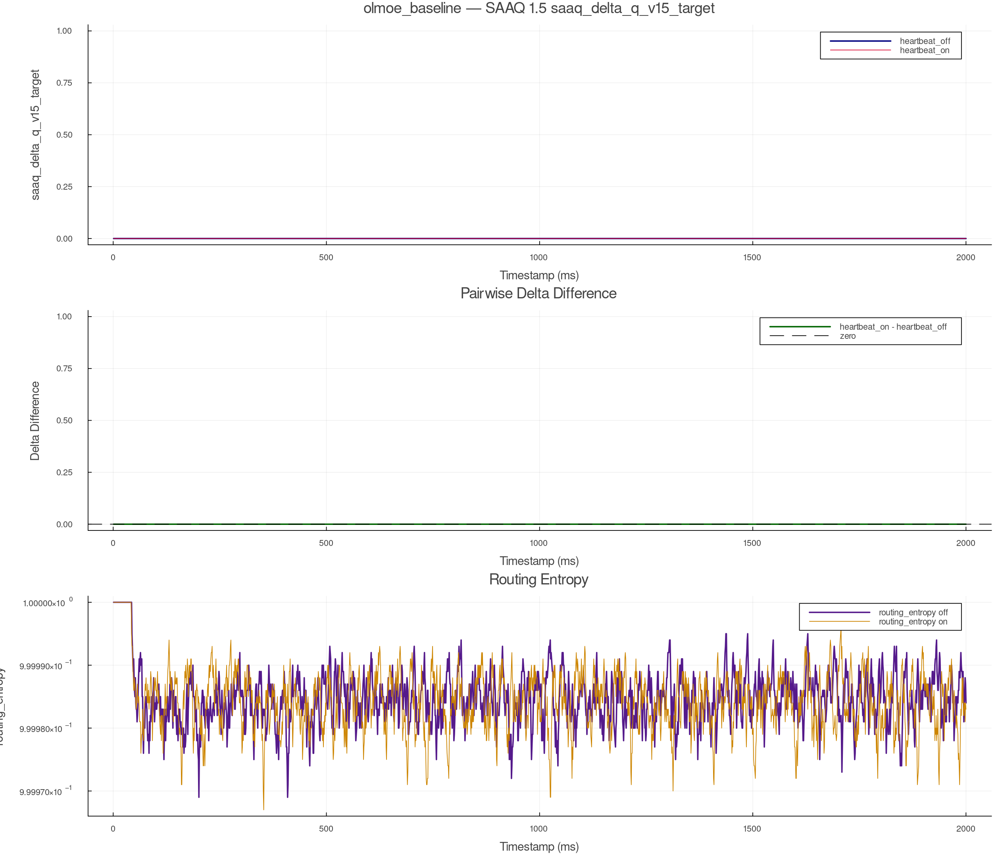
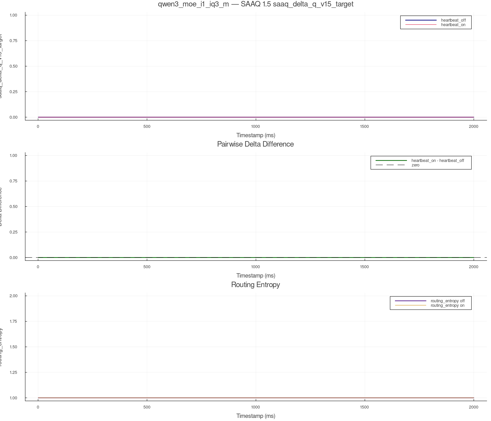
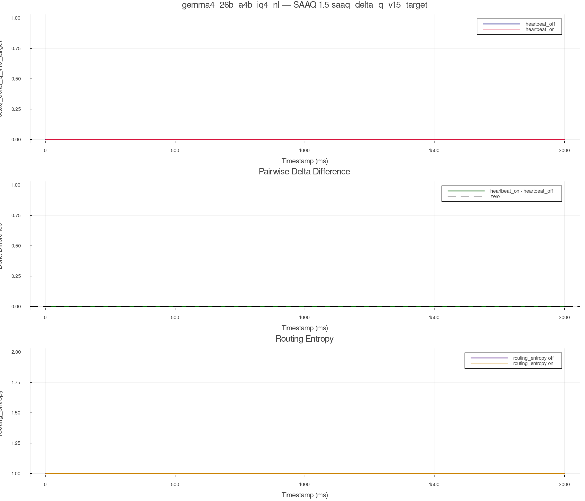
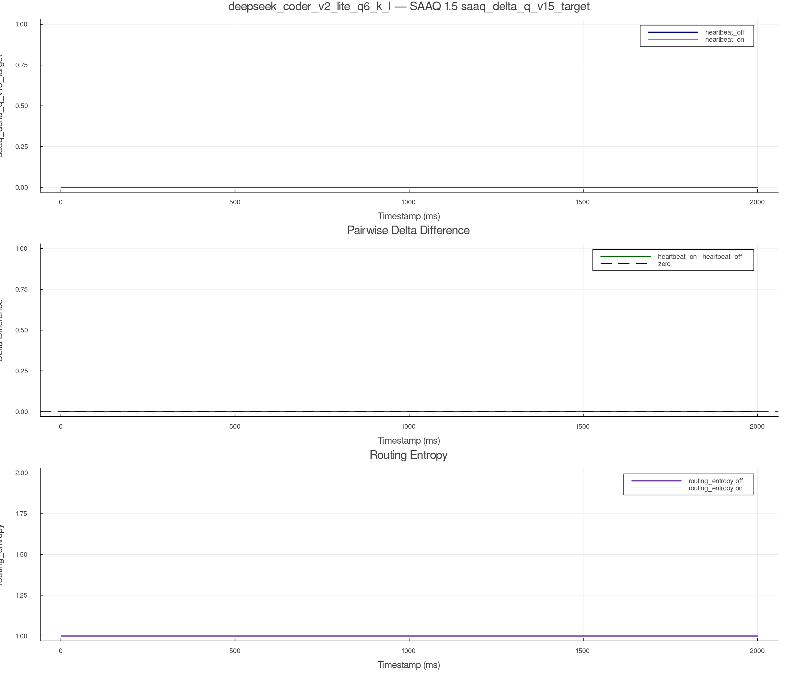
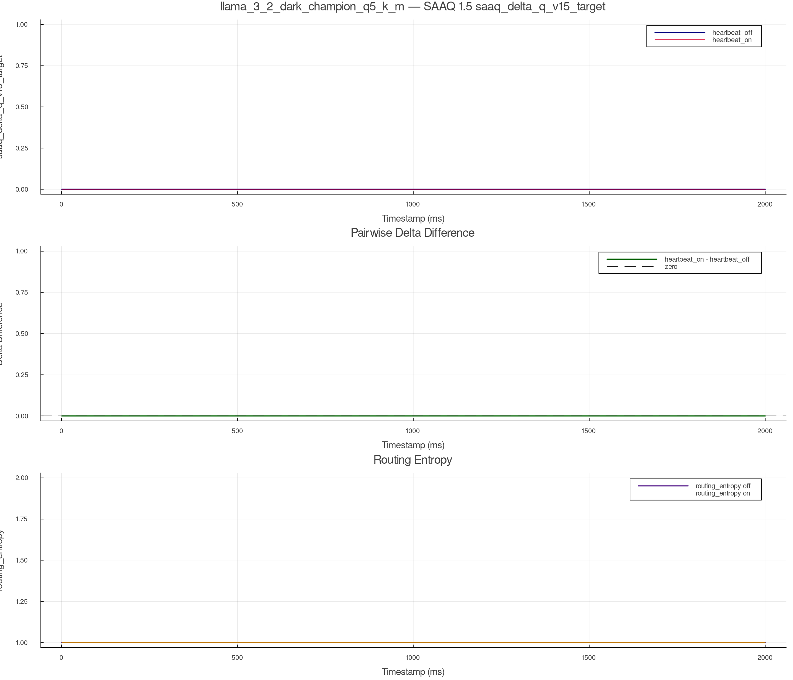

# Full Lineup SAAQ 1.5 Heartbeat Comparison

- Campaign: `full_lineup`
- Repeat index: `0`
- Telemetry source: `csv_re4_path_tracing_telemetry`
- Rule: `SaaqV1_5SqrtRate`
- Models: 5 (olmoe_baseline, qwen3_moe_i1_iq3_m, gemma4_26b_a4b_iq4_nl, deepseek_coder_v2_lite_q6_k_l, llama_3_2_dark_champion_q5_k_m)
- Generated: `2026-04-28T20:23:56`

## olmoe_baseline (Olmoe)

- heartbeat_off run: `20260428T220901_math_logic_r0_full_lineup_csv_off`
- heartbeat_on  run: `20260428T221748_math_logic_r0_full_lineup_csv_on`
- imported off:    `data/corinth_runs/olmoe_baseline/csv_re4_path_tracing_telemetry/heartbeat_off/20260428T220901_math_logic_r0_full_lineup_csv_off/latent_telemetry.csv`
- imported on:     `data/corinth_runs/olmoe_baseline/csv_re4_path_tracing_telemetry/heartbeat_on/20260428T221748_math_logic_r0_full_lineup_csv_on/latent_telemetry.csv`
- delta column:    `saaq_delta_q_v15_target`
- routing entropy: `routing_entropy`

| Heartbeat | Rows | First ms | Last ms | Mean delta | Max delta | Final delta | Mean entropy | Final entropy |
| --- | ---: | ---: | ---: | ---: | ---: | ---: | ---: | ---: |
| `heartbeat_off` | 2000 | 1 | 2000 | 0.0 | 0.0 | 0.0 | 0.999985 | 0.999984 |
| `heartbeat_on` | 2000 | 1 | 2000 | 0.0 | 0.0 | 0.0 | 0.999984 | 0.999983 |

**Pairwise summary**

| Metric | Value |
| --- | ---: |
| Paired rows | 2000 |
| Mean delta (on - off) | 0.0 |
| Max abs delta (on - off) | 0.0 |
| Final delta (on - off) | 0.0 |
| Mean entropy (on - off) | 0.0 |
| Final entropy (on - off) | -1.0e-6 |

## qwen3_moe_i1_iq3_m (Qwen3Moe)

- heartbeat_off run: `20260428T220947_math_logic_r0_full_lineup_csv_off`
- heartbeat_on  run: `20260428T221834_math_logic_r0_full_lineup_csv_on`
- imported off:    `data/corinth_runs/qwen3_moe_i1_iq3_m/csv_re4_path_tracing_telemetry/heartbeat_off/20260428T220947_math_logic_r0_full_lineup_csv_off/latent_telemetry.csv`
- imported on:     `data/corinth_runs/qwen3_moe_i1_iq3_m/csv_re4_path_tracing_telemetry/heartbeat_on/20260428T221834_math_logic_r0_full_lineup_csv_on/latent_telemetry.csv`
- delta column:    `saaq_delta_q_v15_target`
- routing entropy: `routing_entropy`

| Heartbeat | Rows | First ms | Last ms | Mean delta | Max delta | Final delta | Mean entropy | Final entropy |
| --- | ---: | ---: | ---: | ---: | ---: | ---: | ---: | ---: |
| `heartbeat_off` | 2000 | 1 | 2000 | 0.0 | 0.0 | 0.0 | 1.0 | 1.0 |
| `heartbeat_on` | 2000 | 1 | 2000 | 0.0 | 0.0 | 0.0 | 1.0 | 1.0 |

**Pairwise summary**

| Metric | Value |
| --- | ---: |
| Paired rows | 2000 |
| Mean delta (on - off) | 0.0 |
| Max abs delta (on - off) | 0.0 |
| Final delta (on - off) | 0.0 |
| Mean entropy (on - off) | 0.0 |
| Final entropy (on - off) | 0.0 |

## gemma4_26b_a4b_iq4_nl (Gemma4)

- heartbeat_off run: `20260428T221036_math_logic_r0_full_lineup_csv_off`
- heartbeat_on  run: `20260428T221922_math_logic_r0_full_lineup_csv_on`
- imported off:    `data/corinth_runs/gemma4_26b_a4b_iq4_nl/csv_re4_path_tracing_telemetry/heartbeat_off/20260428T221036_math_logic_r0_full_lineup_csv_off/latent_telemetry.csv`
- imported on:     `data/corinth_runs/gemma4_26b_a4b_iq4_nl/csv_re4_path_tracing_telemetry/heartbeat_on/20260428T221922_math_logic_r0_full_lineup_csv_on/latent_telemetry.csv`
- delta column:    `saaq_delta_q_v15_target`
- routing entropy: `routing_entropy`

| Heartbeat | Rows | First ms | Last ms | Mean delta | Max delta | Final delta | Mean entropy | Final entropy |
| --- | ---: | ---: | ---: | ---: | ---: | ---: | ---: | ---: |
| `heartbeat_off` | 2000 | 1 | 2000 | 0.0 | 0.0 | 0.0 | 1.0 | 1.0 |
| `heartbeat_on` | 2000 | 1 | 2000 | 0.0 | 0.0 | 0.0 | 1.0 | 1.0 |

**Pairwise summary**

| Metric | Value |
| --- | ---: |
| Paired rows | 2000 |
| Mean delta (on - off) | 0.0 |
| Max abs delta (on - off) | 0.0 |
| Final delta (on - off) | 0.0 |
| Mean entropy (on - off) | 0.0 |
| Final entropy (on - off) | 0.0 |

## deepseek_coder_v2_lite_q6_k_l (DeepSeek2)

- heartbeat_off run: `20260428T221121_math_logic_r0_full_lineup_csv_off`
- heartbeat_on  run: `20260428T222008_math_logic_r0_full_lineup_csv_on`
- imported off:    `data/corinth_runs/deepseek_coder_v2_lite_q6_k_l/csv_re4_path_tracing_telemetry/heartbeat_off/20260428T221121_math_logic_r0_full_lineup_csv_off/latent_telemetry.csv`
- imported on:     `data/corinth_runs/deepseek_coder_v2_lite_q6_k_l/csv_re4_path_tracing_telemetry/heartbeat_on/20260428T222008_math_logic_r0_full_lineup_csv_on/latent_telemetry.csv`
- delta column:    `saaq_delta_q_v15_target`
- routing entropy: `routing_entropy`

| Heartbeat | Rows | First ms | Last ms | Mean delta | Max delta | Final delta | Mean entropy | Final entropy |
| --- | ---: | ---: | ---: | ---: | ---: | ---: | ---: | ---: |
| `heartbeat_off` | 2000 | 1 | 2000 | 0.0 | 0.0 | 0.0 | 1.0 | 1.0 |
| `heartbeat_on` | 2000 | 1 | 2000 | 0.0 | 0.0 | 0.0 | 1.0 | 1.0 |

**Pairwise summary**

| Metric | Value |
| --- | ---: |
| Paired rows | 2000 |
| Mean delta (on - off) | 0.0 |
| Max abs delta (on - off) | 0.0 |
| Final delta (on - off) | 0.0 |
| Mean entropy (on - off) | 0.0 |
| Final entropy (on - off) | 0.0 |

## llama_3_2_dark_champion_q5_k_m (LlamaMoe)

- heartbeat_off run: `20260428T221244_math_logic_r0_full_lineup_csv_off`
- heartbeat_on  run: `20260428T222131_math_logic_r0_full_lineup_csv_on`
- imported off:    `data/corinth_runs/llama_3_2_dark_champion_q5_k_m/csv_re4_path_tracing_telemetry/heartbeat_off/20260428T221244_math_logic_r0_full_lineup_csv_off/latent_telemetry.csv`
- imported on:     `data/corinth_runs/llama_3_2_dark_champion_q5_k_m/csv_re4_path_tracing_telemetry/heartbeat_on/20260428T222131_math_logic_r0_full_lineup_csv_on/latent_telemetry.csv`
- delta column:    `saaq_delta_q_v15_target`
- routing entropy: `routing_entropy`

| Heartbeat | Rows | First ms | Last ms | Mean delta | Max delta | Final delta | Mean entropy | Final entropy |
| --- | ---: | ---: | ---: | ---: | ---: | ---: | ---: | ---: |
| `heartbeat_off` | 2000 | 1 | 2000 | 0.0 | 0.0 | 0.0 | 1.0 | 1.0 |
| `heartbeat_on` | 2000 | 1 | 2000 | 0.0 | 0.0 | 0.0 | 1.0 | 1.0 |

**Pairwise summary**

| Metric | Value |
| --- | ---: |
| Paired rows | 2000 |
| Mean delta (on - off) | 0.0 |
| Max abs delta (on - off) | 0.0 |
| Final delta (on - off) | 0.0 |
| Mean entropy (on - off) | 0.0 |
| Final entropy (on - off) | 0.0 |

## Cross-Model Delta Cheat Sheet

| Model | Family | Mean delta (on - off) | Max abs delta (on - off) | Final delta (on - off) |
| --- | --- | ---: | ---: | ---: |
| `olmoe_baseline` | `Olmoe` | 0.0 | 0.0 | 0.0 |
| `qwen3_moe_i1_iq3_m` | `Qwen3Moe` | 0.0 | 0.0 | 0.0 |
| `gemma4_26b_a4b_iq4_nl` | `Gemma4` | 0.0 | 0.0 | 0.0 |
| `deepseek_coder_v2_lite_q6_k_l` | `DeepSeek2` | 0.0 | 0.0 | 0.0 |
| `llama_3_2_dark_champion_q5_k_m` | `LlamaMoe` | 0.0 | 0.0 | 0.0 |

